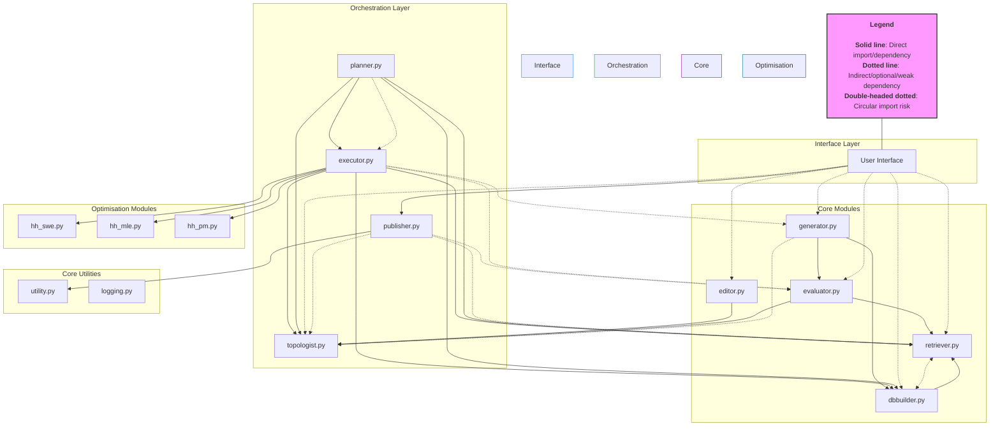

# AutoLM

## Project Overview
Auto GAI is an advanced, modular framework for automated generation, evaluation, and refinement of AI prompts and knowledge bases. It is designed to support research, experimentation, and deployment of prompt engineering workflows, including retrieval-augmented generation, evaluation, and publishing to external platforms.

## Architecture Diagram



**Diagram Description:**
- **Solid lines** indicate direct imports/dependencies between modules.
- **Dotted lines** indicate indirect, optional, or weak dependencies.
- **Double-headed dotted lines** highlight circular import risks.
- Modules are grouped by hierarchy: Interface, Orchestration, Core Modules, Core Utilities, and Optimisation Modules.

*For a detailed, interactive dependency diagram and explanations, see `docs/analysis/module_dependency.md`.*

## Component Descriptions

- **logging.py**: Configures logging using loguru for consistent, formatted logs.
- **utility.py**: Provides utility functions and helpers used throughout the project.
- **generator.py**: Handles model interactions and text generation, supporting Azure OpenAI and HuggingFace models.
- **editor.py**: Implements prompt enhancement and template adoption strategies.
- **evaluator.py**: Evaluates generated text using metrics like BLEU and includes retrieval-based evaluation.
- **topologist.py**: Defines and orchestrates prompt execution topologies, including advanced strategies (e.g., genetic algorithms, regenerative majority synthesis).
- **dbbuilder.py**: Manages data cleansing, chunking, and vector database construction.
- **publisher.py**: Publishes content to external platforms (e.g., Confluence) with Markdown and LaTeX support.
- **retriever.py**: Implements retrieval and reranking for vector databases, supporting advanced document search and reranking.

## Setup and Installation

1. **Clone the repository:**
   ```bash
   git clone <your-repo-url>
   cd auto_gai
   ```
2. **Set up a virtual environment (recommended):**
   ```bash
   python3 -m venv venv
   source venv/bin/activate
   ```
3. **Install dependencies:**
   - If you have a `requirements.txt`, run:
     ```bash
     pip install -r requirements.txt
     ```
   - Otherwise, install core dependencies manually (example):
     ```bash
     pip install loguru pandas numpy scikit-learn openai
     ```
   - Add any other dependencies as needed for your use case.

## Development Workflow

- **Branching:**
  - Use feature branches for new features (`feature/<name>`), bugfixes (`bugfix/<name>`), and documentation (`docs/<name>`).
- **Code Style:**
  - Follow [PEP8](https://peps.python.org/pep-0008/) for Python code.
  - Use type hints and docstrings for all public functions/classes.
- **Documentation:**
  - Update the `docs/` directory for architectural or analytical changes.
  - Keep `README.md` and module docstrings up to date.
- **Commits:**
  - Write clear, descriptive commit messages.

## Testing Procedures

- **Unit and Integration Tests:**
  - Place tests in a `tests/` directory (create if missing).
  - Use `pytest` or Python’s built-in `unittest` framework.
  - Example to run all tests:
    ```bash
    pytest
    ```
- **Test Coverage:**
  - Aim for high coverage on core modules (generator, evaluator, retriever, dbbuilder, topologist).
- **Continuous Integration:**
  - Integrate with GitHub Actions or another CI tool for automated testing (recommended).

---

For more details, see the [module dependency analysis](docs/analysis/module_dependency.md) and in-code documentation.

---
*Last updated: 2025-05-18*
