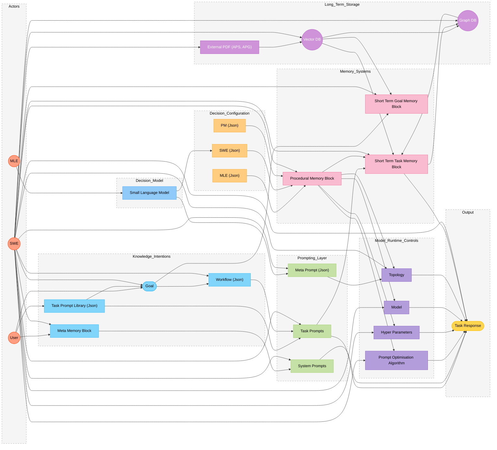

```mermaid
%% AutoLLM system design
graph LR

    %% actors
    user((User))
    builder((MLE))
    builderC((SWE))

    %% knowledge & intentions
    metaMemory["Meta Memory Block"]
    taskPromptLibrary["Task Prompt Library (Json)"]
    goal([Goal])
    workflow["Workflow (Json)"]

    %% prompting layer
    systemPrompts["System Prompts"]
    taskPrompts["Task Prompts"]
    metaPromptJson["Meta Prompt (Json)"]

    %% short-term / procedural memory
    stGoalMemory["Short Term Goal Memory Block"]
    stTaskMemory["Short Term Task Memory Block"]
    proceduralMemory["Procedural Memory Block"]

    %% long-term storage
    vectorDB(("Vector DB"))
    graphDB(("Graph DB"))
    extPDF["External PDF (APS, APG)"]

    %% decision configuration
    mleJson["MLE (Json)"]
    sweJson["SWE (Json)"]
    pmJson["PM (Json)"]

    %% decision model
    slm["Small Language Model"]

    %% model & runtime controls
    promptOpt["Prompt Optimisation Algorithm"]
    hyperParams["Hyper Parameters"]
    modelNode["Model"]
    topology["Topology"]

    %% final output
    taskResponse([Task Response])

    %% subgraphs for grouping
    subgraph Actors
      user; builder; builderC
    end

    subgraph Knowledge_Intentions
      metaMemory; taskPromptLibrary; goal; workflow
    end

    subgraph Prompting_Layer
      systemPrompts; taskPrompts; metaPromptJson
    end

    subgraph Memory_Systems
      stGoalMemory; stTaskMemory; proceduralMemory
    end

    subgraph Long_Term_Storage
      vectorDB; graphDB; extPDF
    end

    subgraph Decision_Configuration
      mleJson; sweJson; pmJson
    end

    subgraph Decision_Model
      slm
    end

    subgraph Model_Runtime_Controls
      promptOpt; hyperParams; modelNode; topology
    end

    subgraph Output
      taskResponse
    end

    %% connections
    user --> metaMemory
    user --> taskPromptLibrary
    user --> goal

    builder --> slm

    taskPromptLibrary --> goal
    taskPromptLibrary --> taskPrompts
    metaMemory --> systemPrompts

    goal --> workflow
    goal --> stGoalMemory
    workflow --> taskPrompts

    taskPrompts --> stTaskMemory
    taskPrompts --> taskResponse
    systemPrompts --> taskResponse

    vectorDB --> stGoalMemory
    vectorDB --> stTaskMemory
    vectorDB --> graphDB
    graphDB --> stTaskMemory
    stTaskMemory --> graphDB

    extPDF --> vectorDB

    proceduralMemory --> stTaskMemory
    mleJson --> proceduralMemory
    sweJson --> proceduralMemory
    pmJson --> proceduralMemory

    slm --> metaPromptJson
    slm --> sweJson
    metaPromptJson --> topology

    proceduralMemory --> promptOpt
    proceduralMemory --> hyperParams
    proceduralMemory --> modelNode
    proceduralMemory --> topology

    promptOpt --> taskResponse
    hyperParams --> taskResponse
    modelNode --> taskResponse
    topology --> taskResponse
    stTaskMemory --> taskResponse

    %% Build C’s links (to all but Actors, Decision Model, Decision Configuration)
    builderC --> metaMemory
    builderC --> goal
    builderC --> workflow
    builderC --> systemPrompts
    builderC --> taskPrompts
    builderC --> metaPromptJson
    builderC --> stGoalMemory
    builderC --> stTaskMemory
    builderC --> proceduralMemory
    builderC --> vectorDB
    builderC --> graphDB
    builderC --> extPDF
    builderC --> promptOpt
    builderC --> hyperParams
    builderC --> modelNode
    builderC --> topology
    builderC --> taskResponse

    %% Style definitions
    classDef actorStyle fill:#FF9E80,stroke:#FF6E40,color:#000,stroke-width:2px
    classDef knowledgeStyle fill:#81D4FA,stroke:#29B6F6,color:#000
    classDef promptStyle fill:#C5E1A5,stroke:#9CCC65,color:#000
    classDef memoryStyle fill:#F8BBD0,stroke:#F06292,color:#000
    classDef storageStyle fill:#CE93D8,stroke:#AB47BC,color:#FFF
    classDef configStyle fill:#FFCC80,stroke:#FFA726,color:#000
    classDef decisionStyle fill:#90CAF9,stroke:#42A5F5,color:#000
    classDef controlStyle fill:#B39DDB,stroke:#7E57C2,color:#000
    classDef outputStyle fill:#FFD54F,stroke:#FFC107,color:#000
    classDef subgraphStyle fill:#F5F5F5,stroke:#9E9E9E,color:#000,stroke-dasharray:5

    %% Apply styles
    class user,builder,builderC actorStyle
    class metaMemory,taskPromptLibrary,goal,workflow knowledgeStyle
    class systemPrompts,taskPrompts,metaPromptJson promptStyle
    class stGoalMemory,stTaskMemory,proceduralMemory memoryStyle
    class vectorDB,graphDB,extPDF storageStyle
    class mleJson,sweJson,pmJson configStyle
    class slm decisionStyle
    class promptOpt,hyperParams,modelNode,topology controlStyle
    class taskResponse outputStyle
    class Actors,Knowledge_Intentions,Prompting_Layer,Memory_Systems,Long_Term_Storage,Decision_Configuration,Decision_Model,Model_Runtime_Controls,Output subgraphStyle
```