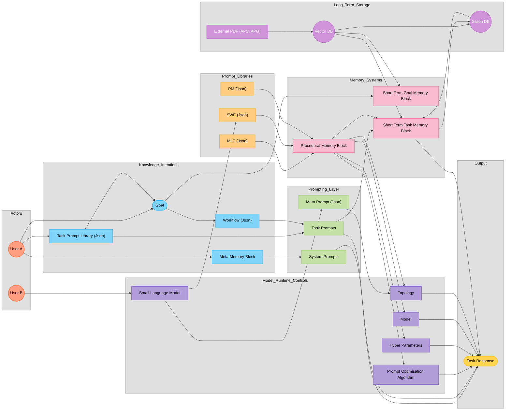

Below is the Mermaid diagram representing the AutoLLM system design. Paste this into any Mermaid-compatible renderer to visualise the full architecture:

```mermaid
%% AutoLLM system design
graph LR

    %% Style definitions
    classDef actorStyle fill:#FF9E80,stroke:#FF6E40,color:#000000,stroke-width:2px
    classDef knowledgeStyle fill:#81D4FA,stroke:#29B6F6,color:#000000
    classDef promptStyle fill:#C5E1A5,stroke:#9CCC65,color:#000000
    classDef memoryStyle fill:#F8BBD0,stroke:#F06292,color:#000000
    classDef storageStyle fill:#CE93D8,stroke:#AB47BC,color:#FFFFFF
    classDef libraryStyle fill:#FFCC80,stroke:#FFA726,color:#000000
    classDef modelStyle fill:#B39DDB,stroke:#7E57C2,color:#000000
    classDef outputStyle fill:#FFD54F,stroke:#FFC107,color:#000000
    classDef subgraphStyle fill:#E0E0E0,stroke:#9E9E9E,color:#000000

    %% actors
    user((User A))
    builder((User B))

    %% knowledge & intentions
    metaMemory["Meta Memory Block"]
    taskPromptLibrary["Task Prompt Library (Json)"]
    goal([Goal])
    workflow["Workflow (Json)"]

    %% prompting layer
    systemPrompts["System Prompts"]
    taskPrompts["Task Prompts"]
    metaPromptJson["Meta Prompt (Json)"]

    %% short-term / procedural memory
    stGoalMemory["Short Term Goal Memory Block"]
    stTaskMemory["Short Term Task Memory Block"]
    proceduralMemory["Procedural Memory Block"]

    %% long-term stores
    vectorDB(("Vector DB"))
    graphDB(("Graph DB"))
    extPDF["External PDF (APS, APG)"]

    %% prompt libraries
    mleJson["MLE (Json)"]
    sweJson["SWE (Json)"]
    pmJson["PM (Json)"]

    %% model & runtime controls
    slm["Small Language Model"]
    promptOpt["Prompt Optimisation Algorithm"]
    hyperParams["Hyper Parameters"]
    modelNode["Model"]
    topology["Topology"]

    %% final output
    taskResponse([Task Response])

    %% subgraphs for grouping
    subgraph Actors
        user; builder
    end
    subgraph Knowledge_Intentions
        metaMemory; taskPromptLibrary; goal; workflow
    end
    subgraph Prompting_Layer
        systemPrompts; taskPrompts; metaPromptJson
    end
    subgraph Memory_Systems
        stGoalMemory; stTaskMemory; proceduralMemory
    end
    subgraph Long_Term_Storage
        vectorDB; graphDB; extPDF
    end
    subgraph Prompt_Libraries
        mleJson; sweJson; pmJson
    end
    subgraph Model_Runtime_Controls
        slm; promptOpt; hyperParams; modelNode; topology
    end
    subgraph Output
        taskResponse
    end

    %% connections
    user --> metaMemory
    user --> taskPromptLibrary
    user --> goal

    taskPromptLibrary --> goal
    taskPromptLibrary --> taskPrompts
    metaMemory --> systemPrompts

    goal --> workflow
    goal --> stGoalMemory
    workflow --> taskPrompts

    taskPrompts --> stTaskMemory
    taskPrompts --> taskResponse
    systemPrompts --> taskResponse

    vectorDB --> stGoalMemory
    vectorDB --> stTaskMemory
    vectorDB --> graphDB
    graphDB --> stTaskMemory
    stTaskMemory --> graphDB

    extPDF --> vectorDB

    proceduralMemory --> stTaskMemory
    mleJson --> proceduralMemory
    sweJson --> proceduralMemory
    pmJson --> proceduralMemory

    builder --> slm
    slm --> metaPromptJson
    slm --> sweJson

    metaPromptJson --> topology

    proceduralMemory --> promptOpt
    proceduralMemory --> hyperParams
    proceduralMemory --> modelNode
    proceduralMemory --> topology

    promptOpt --> taskResponse
    hyperParams --> taskResponse
    modelNode --> taskResponse
    topology --> taskResponse
    stTaskMemory --> taskResponse

    %% Apply styles
    class user,builder actorStyle
    class metaMemory,taskPromptLibrary,goal,workflow knowledgeStyle
    class systemPrompts,taskPrompts,metaPromptJson promptStyle
    class stGoalMemory,stTaskMemory,proceduralMemory memoryStyle
    class vectorDB,graphDB,extPDF storageStyle
    class mleJson,sweJson,pmJson libraryStyle
    class slm,promptOpt,hyperParams,modelNode,topology modelStyle
    class taskResponse outputStyle
    class Actors,Knowledge_Intentions,Prompting_Layer,Memory_Systems,Long_Term_Storage,Prompt_Libraries,Model_Runtime_Controls,Output subgraphStyle
```
