# Executor Functional Analysis

This document provides a functional analysis of the classes and methods in the `executor.py` file, visualized as a Mermaid diagram.

## Class Relationships and Method Interactions

```mermaid
classDiagram
    %% Main Classes
    class MemoryManager {
        +__init__(config)
        +store_task_memory(task_id, original_query, retrieved_info, transformed_query)
        +store_goal_memory(entity_name, entity_information, information_type, goal_context)
        +get_task_memory(task_id)
        +get_goal_memory(entity_name)
        +store_procedural_memory(config_name, config_type, config_content)
        +get_procedural_memory(config_type)
    }
    
    class KnowledgeBaseManager {
        +__init__(config)
        +establish_knowledge_base(source_files, df_headings)
        -_discover_source_files()
        -_convert_pdf_to_markdown(pdf_path)
        -_create_vector_database(markdown_file, df_headings)
        -_create_graph_database(vector_db_path)
    }
    
    class ContextManager {
        +__init__(vector_db_path, graph_db_path, config, memory_manager)
        +identify_common_contexts(shortlisted_prompts)
        -_extract_context_requirements(prompt_id, prompt_data)
        -_extract_keywords(text)
        -_find_common_contexts(context_requirements)
        +retrieve_short_term_goal_memory(common_contexts)
        +assess_context_sufficiency(task_prompt, task_id)
        +retrieve_task_specific_context(task_id, query)
    }
    
    class ExecutionEngine {
        +__init__(config, memory_manager)
        -_load_mle_config()
        +execute_task(task_id, task_prompt, task_type, confidence_level)
        -_determine_task_type_and_confidence(task_prompt)
        -_get_execution_config(task_type, confidence_level)
        -_prepare_context(task_id, task_prompt)
        -_apply_prompt_optimization(task_prompt, execution_config)
        -_execute_with_topology(task_id, task_prompt, execution_config, context_data)
        -_prepare_contextual_prompt(task_prompt, context_data)
        +orchestrate_execution_flow(plan, overall_goal_context)
        -_heuristic_task_analysis(analysis_text)
    }
    
    %% Dependencies
    class DataUtility {
        <<external>>
    }
    
    class Generator {
        <<external>>
    }
    
    class MetaGenerator {
        <<external>>
    }
    
    class Evaluator {
        <<external>>
    }
    
    class AIUtility {
        <<external>>
    }
    
    class TextParser {
        <<external>>
    }
    
    class TextChunker {
        <<external>>
    }
    
    class VectorBuilder {
        <<external>>
    }
    
    class GraphBuilder {
        <<external>>
    }
    
    class VectorDBRetrievalProcessor {
        <<external>>
    }
    
    class GraphDBRetrievalProcessor {
        <<external>>
    }
    
    class QueryProcessor {
        <<external>>
    }
    
    class PromptTopology {
        <<external>>
    }
    
    class ScalingTopology {
        <<external>>
    }
    
    class TemplateAdopter {
        <<external>>
    }
    
    %% Relationships
    MemoryManager --> DataUtility : uses
    
    KnowledgeBaseManager --> DataUtility : uses
    KnowledgeBaseManager --> Generator : uses
    KnowledgeBaseManager --> TextParser : uses
    KnowledgeBaseManager --> TextChunker : uses
    KnowledgeBaseManager --> VectorBuilder : uses
    KnowledgeBaseManager --> GraphBuilder : uses
    
    ContextManager --> MemoryManager : uses
    ContextManager --> Generator : uses
    ContextManager --> MetaGenerator : uses
    ContextManager --> Evaluator : uses
    ContextManager --> AIUtility : uses
    ContextManager --> VectorDBRetrievalProcessor : uses
    ContextManager --> GraphDBRetrievalProcessor : uses
    ContextManager --> QueryProcessor : uses
    
    ExecutionEngine --> MemoryManager : uses
    ExecutionEngine --> Generator : uses
    ExecutionEngine --> MetaGenerator : uses
    ExecutionEngine --> Evaluator : uses
    ExecutionEngine --> AIUtility : uses
    ExecutionEngine --> DataUtility : uses
    ExecutionEngine --> PromptTopology : uses
    ExecutionEngine --> ScalingTopology : uses
    ExecutionEngine --> TemplateAdopter : uses
    
    %% Method interactions
    ExecutionEngine --> MemoryManager : get_task_memory()
    ExecutionEngine --> MemoryManager : get_goal_memory()
    ExecutionEngine --> MemoryManager : get_procedural_memory()
    ExecutionEngine --> MemoryManager : store_goal_memory()
    
    ContextManager --> MemoryManager : store_goal_memory()
    ContextManager --> MemoryManager : store_task_memory()
    ContextManager --> MemoryManager : get_goal_memory()
    ContextManager --> MemoryManager : get_task_memory()
```

## Functional Flow Analysis

The diagram above illustrates the relationships between the four main classes in the `executor.py` file:

1. **MemoryManager**: Handles different types of memory storage (task, goal, procedural, meta)
2. **KnowledgeBaseManager**: Manages knowledge base creation and access using vector and graph databases
3. **ContextManager**: Manages context identification, retrieval, and storage
4. **ExecutionEngine**: Handles task execution with optimization based on mle_config.json

The ExecutionEngine is the central orchestrator that:
- Uses the MemoryManager to retrieve and store context information
- Applies prompt optimization based on execution configuration
- Executes tasks using various topologies (direct, genetic algorithm, best-of-n, etc.)
- Orchestrates the execution flow of multiple tasks

The ContextManager works with the MemoryManager to:
- Identify common contexts required by multiple task prompts
- Retrieve and store information in short-term goal memory
- Assess if available context is sufficient for task execution
- Retrieve task-specific context when needed

The KnowledgeBaseManager handles:
- Discovering and processing source files
- Converting PDFs to markdown
- Creating vector and graph databases for knowledge retrieval

All classes depend on various external utilities for text processing, generation, evaluation, and database operations.
