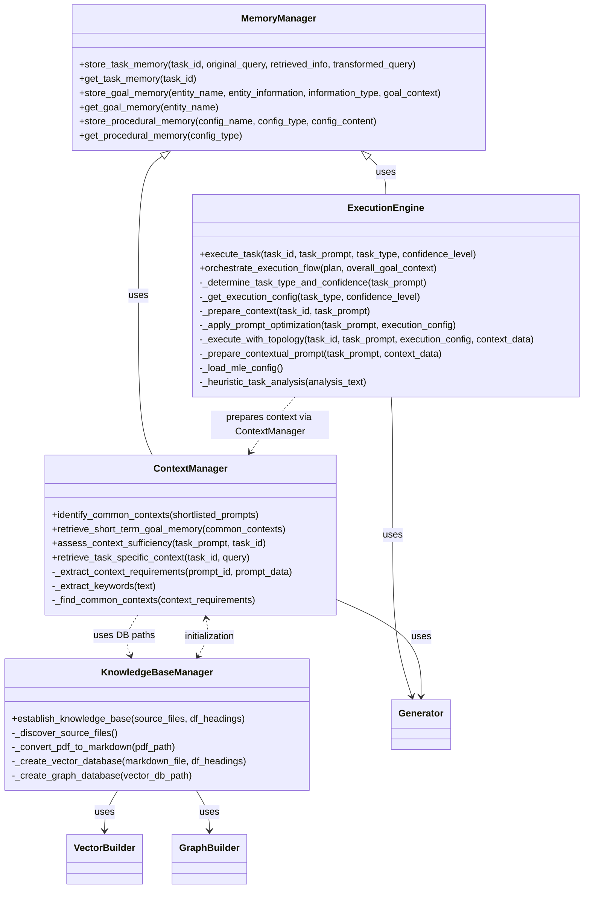

# Executor Module Overview

This document breaks down the four main classes in `executor.py`, their public methods, and how they interact.

---

```mermaid
classDiagram
    MemoryManager <|-- ContextManager : uses
    MemoryManager <|-- ExecutionEngine : uses
    KnowledgeBaseManager <..> ContextManager : initialization
    ExecutionEngine ..> ContextManager : prepares context via ContextManager
    ContextManager ..> KnowledgeBaseManager : uses DB paths
    ExecutionEngine --> Generator : uses
    ContextManager --> Generator : uses
    KnowledgeBaseManager --> VectorBuilder : uses
    KnowledgeBaseManager --> GraphBuilder : uses

    class MemoryManager {
      +store_task_memory(task_id, original_query, retrieved_info, transformed_query)
      +get_task_memory(task_id)
      +store_goal_memory(entity_name, entity_information, information_type, goal_context)
      +get_goal_memory(entity_name)
      +store_procedural_memory(config_name, config_type, config_content)
      +get_procedural_memory(config_type)
    }

    class KnowledgeBaseManager {
      +establish_knowledge_base(source_files, df_headings)
      -_discover_source_files()
      -_convert_pdf_to_markdown(pdf_path)
      -_create_vector_database(markdown_file, df_headings)
      -_create_graph_database(vector_db_path)
    }

    class ContextManager {
      +identify_common_contexts(shortlisted_prompts)
      +retrieve_short_term_goal_memory(common_contexts)
      +assess_context_sufficiency(task_prompt, task_id)
      +retrieve_task_specific_context(task_id, query)
      -_extract_context_requirements(prompt_id, prompt_data)
      -_extract_keywords(text)
      -_find_common_contexts(context_requirements)
    }

    class ExecutionEngine {
      +execute_task(task_id, task_prompt, task_type, confidence_level)
      +orchestrate_execution_flow(plan, overall_goal_context)
      -_determine_task_type_and_confidence(task_prompt)
      -_get_execution_config(task_type, confidence_level)
      -_prepare_context(task_id, task_prompt)
      -_apply_prompt_optimization(task_prompt, execution_config)
      -_execute_with_topology(task_id, task_prompt, execution_config, context_data)
      -_prepare_contextual_prompt(task_prompt, context_data)
      -_load_mle_config()
      -_heuristic_task_analysis(analysis_text)
    }
```