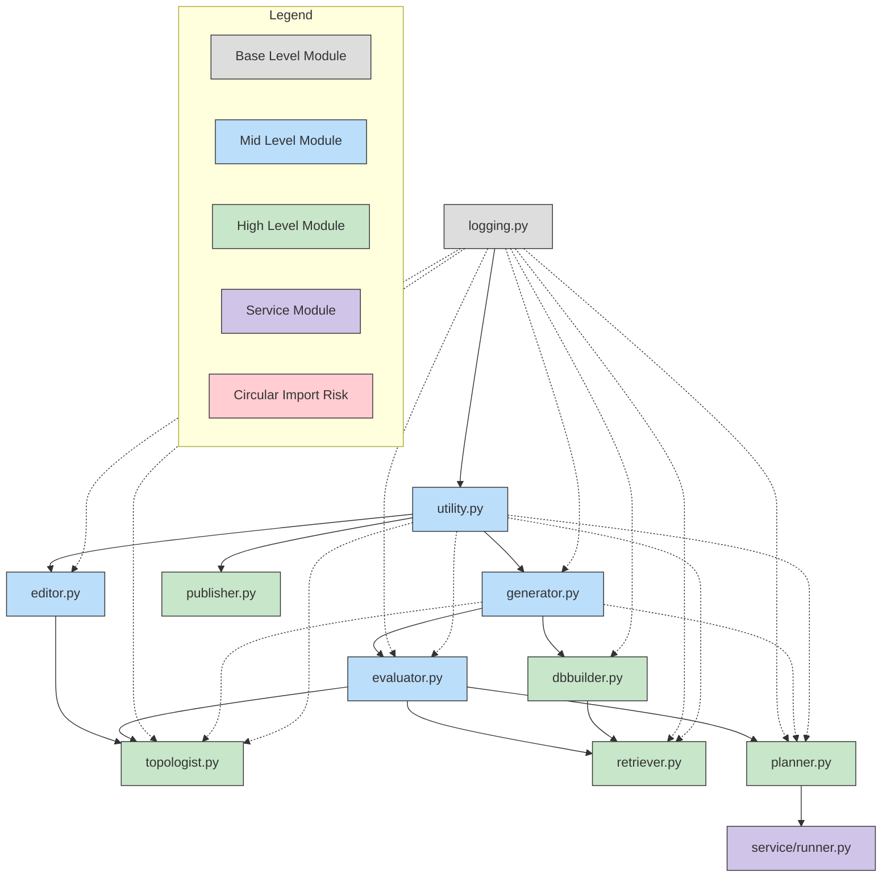

# Module Dependencies and Import Hierarchy Analysis

This document provides a comprehensive analysis of the module dependencies, import hierarchy, and potential circular import risks in the Auto GAI codebase.

## 1. Dependencies Between Modules

### Direct Import Relationships

```
logging.py:
- No internal imports (uses external loguru)

utility.py:
- src.logging

editor.py:
- src.logging
- src.utility (AIUtility)

generator.py:
- src.logging
- src.utility (DataUtility, StatisticsUtility, AIUtility)

evaluator.py:
- src.logging
- src.generator (Generator)
- src.utility (DataUtility, StatisticsUtility, AIUtility)

topologist.py:
- src.logging
- src.generator (MetaGenerator, Generator)
- src.evaluator (Evaluator)
- src.utility (AIUtility)
- src.editor (TemplateAdopter)

dbbuilder.py:
- src.logging
- src.utility (AIUtility)
- src.generator (Generator, MetaGenerator)

publisher.py:
- src.logging

retriever.py:
- src.logging
- src.dbbuilder (GraphBuilder)
- src.generator (Generator, MetaGenerator)
- src.utility (DataUtility, AIUtility)
- src.evaluator (Evaluator, RetrievalEvaluator)

planner.py:
- src.logging
- src.generator (Generator, MetaGenerator)
- src.utility (AIUtility, DataUtility)
- src.evaluator (Evaluator)

service/runner.py:
- src.planner (TaskPlanner)
```

## 2. Import Hierarchy (Dependency Tree)

The following diagram represents the hierarchical dependency structure of the modules:

```
logging.py (Base level - no internal dependencies)
↓
utility.py (depends on logging)
↓
generator.py (depends on logging, utility)
↓
editor.py (depends on logging, utility)
↓
evaluator.py (depends on logging, generator, utility)
↓
topologist.py (depends on logging, generator, evaluator, utility, editor)
↓
dbbuilder.py (depends on logging, utility, generator)
↓
planner.py (depends on logging, generator, utility, evaluator)
↓
publisher.py (depends on logging)
↓
retriever.py (depends on logging, dbbuilder, generator, utility, evaluator)
↓
service/runner.py (depends on planner)
```

### Mermaid Diagram of Module Dependencies



The diagram above illustrates:
- Solid arrows represent primary dependencies
- Dotted arrows represent additional dependencies
- Red node indicates a module with circular import risk
- Different colors represent different module levels (base, mid, high, service)

## 3. Circular Import Risks

### Identified Circular Dependencies:

1. **retriever.py ↔ dbbuilder.py**:
   - Previously, `retriever.py` was directly importing `GraphBuilder` from `dbbuilder`
   - This has been updated to use the `src.dbbuilder` prefix
   - **Risk Level**: Low
   - **Note**: The direct import has been updated with the `src.` prefix

2. **evaluator.py ↔ generator.py**:
   - `evaluator.py` imports `Generator` from `src.generator`
   - `generator.py` doesn't currently import from `evaluator.py`, but if it did, it would create a circular dependency
   - **Risk Level**: Medium
   - **Recommendation**: Monitor any future changes to `generator.py` that might introduce imports from `evaluator.py`

3. **RetrievalEvaluator class in evaluator.py**:
   - The `RetrievalEvaluator` class initializes an `Evaluator` instance, which could lead to recursive initialization issues
   - **Risk Level**: Medium
   - **Recommendation**: Consider moving `RetrievalEvaluator` to its own file or restructuring to avoid potential circular dependencies

4. **planner.py ↔ evaluator.py**:
   - `planner.py` imports `Evaluator` from `src.evaluator`
   - The TaskPlanner uses Evaluator for BERTScore calculations and relevance metrics
   - While not currently a circular import, future enhancements to evaluator.py that might import from planner.py would create a circular dependency
   - **Risk Level**: Low
   - **Recommendation**: Consider design patterns to decouple these modules if deeper integration is needed in the future

## 4. Module Functionality and Dependency Map

### Core Modules (Lowest Level)
- **logging.py**: 
  - Provides logging functionality using loguru
  - Configures custom formatting for logs
  - No internal dependencies

- **utility.py**: 
  - Contains utility classes (DataUtility, StatisticsUtility, AIUtility)
  - DataUtility: Handles file operations, data format conversions
  - StatisticsUtility: Provides statistical operations
  - AIUtility: Manages AI-related operations, token processing, prompt templates
  - Depends on: logging.py

### Mid-Level Modules
- **generator.py**: 
  - Handles model interactions and text generation
  - Provides token management
  - Integrates with Azure OpenAI API and HuggingFace models
  - Contains Generator, MetaGenerator, and Encoder classes
  - Depends on: logging.py, utility.py

- **editor.py**: 
  - Provides template adoption functionality
  - Enhances prompts with different reasoning patterns
  - Contains TemplateAdopter class
  - Depends on: logging.py, utility.py

- **evaluator.py**: 
  - Evaluates generated text against reference text
  - Implements various NLP metrics (BLEU, ROUGE, BERTScore)
  - Contains Evaluator and RetrievalEvaluator classes
  - Depends on: logging.py, generator.py, utility.py

### High-Level Modules
- **topologist.py**: 
  - Implements different patterns for executing prompts using meta-prompts
  - Contains PromptTopology and ScalingTopology classes
  - Implements various topologies (disambiguation, genetic algorithm, regenerative majority synthesis, etc.)
  - Depends on: logging.py, generator.py, evaluator.py, utility.py, editor.py

- **planner.py**:
  - Responsible for planning task execution by selecting and sequencing task prompts
  - Creates workflow configurations based on goals and prompt libraries
  - Analyzes goals and evaluates prompt relevance with semantic similarity
  - Contains TaskPlanner class
  - Depends on: logging.py, generator.py, utility.py, evaluator.py

- **dbbuilder.py**: 
  - Provides text parsing, chunking, and vector/graph database building
  - Contains TextParser, TextChunker, VectorBuilder, and GraphBuilder classes
  - Manages knowledge base construction
  - Depends on: logging.py, utility.py, generator.py

- **publisher.py**: 
  - Handles publishing content to Confluence
  - Supports Markdown and LaTeX formatting
  - Contains ConfluencePublisher class
  - Depends on: logging.py

- **retriever.py**: 
  - Responsible for retrieving relevant documents based on queries
  - Implements vector-based, graph-based, symbolic, and hybrid retrieval methods
  - Contains QueryProcessor, RerankProcessor, VectorDBRetrievalProcessor, GraphDBRetrievalProcessor, and InfoRetriever classes
  - Depends on: logging.py, dbbuilder.py, generator.py, utility.py, evaluator.py

## 5. Recommendations for Improvement

1. **Fix the Direct Import in retriever.py**:
   - Change `from dbbuilder import GraphBuilder` to `from src.dbbuilder import GraphBuilder` for consistency
   - This will prevent potential circular import issues if dbbuilder.py ever needs to import from retriever.py

2. **Refactor RetrievalEvaluator**:
   - Consider moving `RetrievalEvaluator` to its own file or restructuring to avoid potential circular dependencies
   - This will improve code organization and reduce the risk of recursive initialization

3. **Add the New Topology**:
   - Based on the memory, add the "Regenerative Majority Synthesis" topology to `topologist.py` in the `ScalingTopology` class
   - This will generate multiple responses, truncate them, regenerate, and apply majority vote or synthesis
   - Parameters include `num_initial_responses`, `num_regen_responses`, `cut_off_fraction`, and `synthesis_method`

4. **Modularize Large Classes**:
   - Consider breaking down large classes in `dbbuilder.py` and `retriever.py` into smaller, more focused modules
   - This will improve maintainability and readability of the codebase

5. **Standardize Import Patterns**:
   - Use consistent import patterns across all modules (e.g., always use `from src.module import Class`)
   - This will prevent potential import issues and make the codebase more maintainable

6. **Implement Lazy Loading**:
   - Consider implementing lazy loading for heavy dependencies to reduce initialization time
   - This can be particularly useful for modules that import many large dependencies

7. **Add Type Hints**:
   - Ensure consistent use of type hints across all modules
   - This will improve code readability and enable better IDE support

8. **Document Module Interfaces**:
   - Add clear documentation for each module's public interface
   - This will make it easier for developers to understand how to use each module correctly

## 6. Class Dependency Diagram

```
AIUtility (utility.py)
↑
Generator (generator.py) ← MetaGenerator (generator.py)
↑                        ↑
Evaluator (evaluator.py) ← RetrievalEvaluator (evaluator.py)
↑                        ↑
TemplateAdopter (editor.py)
↑
PromptTopology (topologist.py) → ScalingTopology (topologist.py)
                               ↑
TextParser (dbbuilder.py) → TextChunker (dbbuilder.py) → VectorBuilder (dbbuilder.py) → GraphBuilder (dbbuilder.py)
                                                                                      ↑
ConfluencePublisher (publisher.py)                                                    ↑
                                                                                      ↑
QueryProcessor (retriever.py) → RerankProcessor (retriever.py) → VectorDBRetrievalProcessor (retriever.py) → GraphDBRetrievalProcessor (retriever.py) → InfoRetriever (retriever.py)
```

### Service Modules
- **service/runner.py**:
  - Provides execution functionality for task planning workflows
  - Demonstrates TaskPlanner usage with evaluation models
  - Uses planner to execute tasks and evaluate prompt relevance
  - Depends on: src.planner (TaskPlanner)

## 5. Recommendations for Dependency Management

1. **Standardize Import Conventions**:
   - All internal imports should use the `src.` prefix for consistency
   - Use consistent import conventions throughout the codebase

2. **Modularization Improvements**:
   - Consider moving `RetrievalEvaluator` to its own file to avoid potential initialization issues
   - The new TaskPlanner class is well-positioned in the hierarchy, but monitor for potential circular dependencies with evaluator.py

3. **Service Layer Architecture**:
   - The new service/runner.py follows good practice by depending only on planner.py
   - Consider expanding the service layer pattern for other high-level functionality

4. **Dependency Injection**:
   - Most modules already support dependency injection through optional parameters
   - Continue this pattern to make testing easier and reduce tight coupling

This analysis provides a clear view of the module dependencies and potential circular import risks in the codebase.
