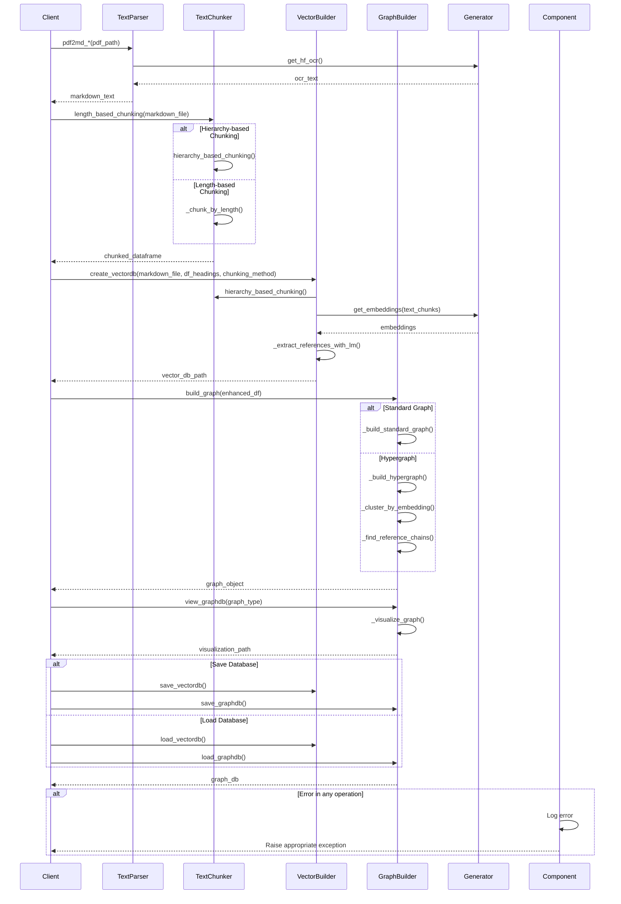

This document breaks down the sequence of interactions in the `dbbuilder.py` module.

## Key Components and Interactions

1. **TextParser**: Handles document parsing and conversion
   - Converts PDFs to markdown using various methods (OCR, markdown conversion)
   - Supports multiple conversion backends (PyMuPDF, OCR, etc.)

2. **TextChunker**: Manages text segmentation
   - Implements length-based and hierarchy-based chunking
   - Preserves document structure during segmentation
   - Configurable chunk sizes and overlaps

3. **VectorBuilder**: Creates and manages vector databases
   - Generates embeddings for text chunks
   - Extracts and resolves references between chunks
   - Handles vector database storage and retrieval

4. **GraphBuilder**: Builds graph representations
   - Creates standard and hypergraph representations
   - Implements node similarity and clustering
   - Generates visualizations of the knowledge graph

## Main Workflows

### Document Processing
1. Parse PDF documents into markdown
2. Clean and preprocess text
3. Handle different document formats and encodings

### Text Chunking
1. Split documents into manageable chunks
2. Preserve document hierarchy and structure
3. Handle edge cases (tables, lists, code blocks)

### Vector Database Creation
1. Generate embeddings for text chunks
2. Extract and resolve cross-references
3. Store and index vectors for efficient retrieval

### Graph Database Creation
1. Build graph structure from processed text
2. Identify relationships between chunks
3. Support different graph types (standard, hypergraph)

## Error Handling
- Validates input documents and parameters
- Handles malformed or unsupported document formats
- Provides detailed error messages and logging
- Implements retry logic for external service calls
