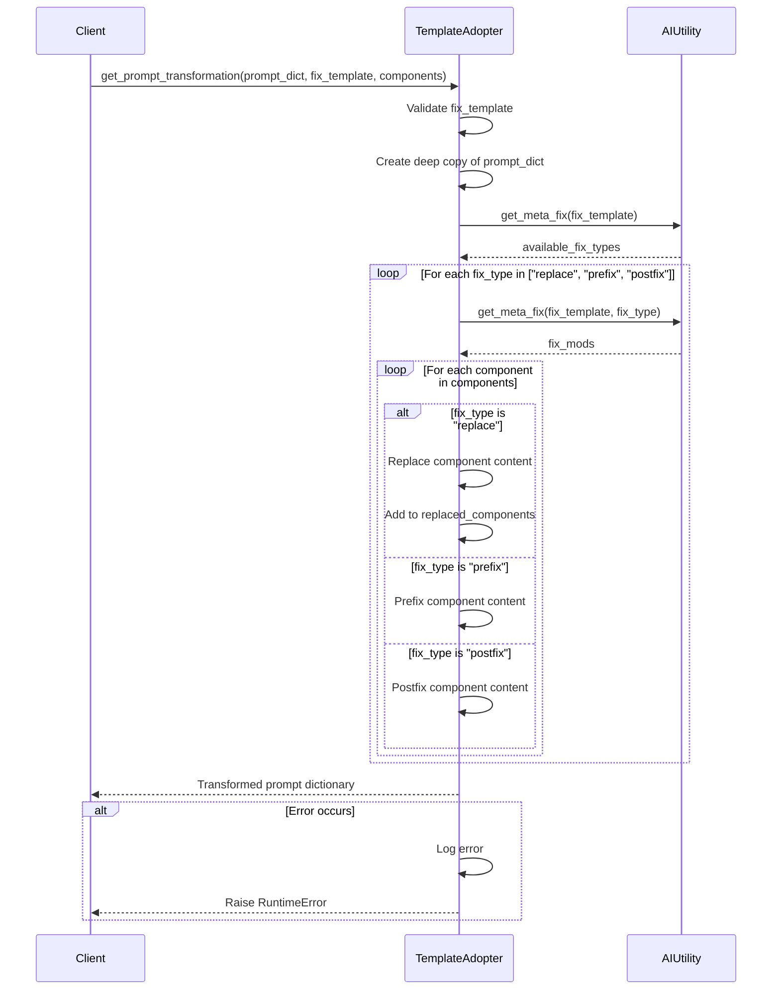

This document breaks down the sequence of interactions in the `editor.py` module.

## Key Components and Interactions

1. **TemplateAdopter**: Main class that handles prompt transformations
   - Applies reasoning patterns to prompt components
   - Manages the transformation process

2. **AIUtility**: Provides access to template configurations
   - Supplies fix templates and modifications
   - Handles metadata about available transformations

## Main Workflow

1. **Initialization**:
   - Validates the requested transformation template
   - Creates a deep copy of the input prompt dictionary

2. **Template Application**:
   - Retrieves available fix types for the template
   - Processes each fix type in order (replace → prefix → postfix)
   - Applies modifications to specified components

3. **Component Modification**:
   - **Replace**: Completely replaces component content
   - **Prefix**: Adds content before component
   - **Postfix**: Adds content after component

4. **Result Handling**:
   - Returns transformed prompt dictionary
   - Includes error handling and logging

## Error Handling
- Validates template types before processing
- Skips components that don't exist in the prompt
- Logs detailed error information
- Preserves original prompt on failure
