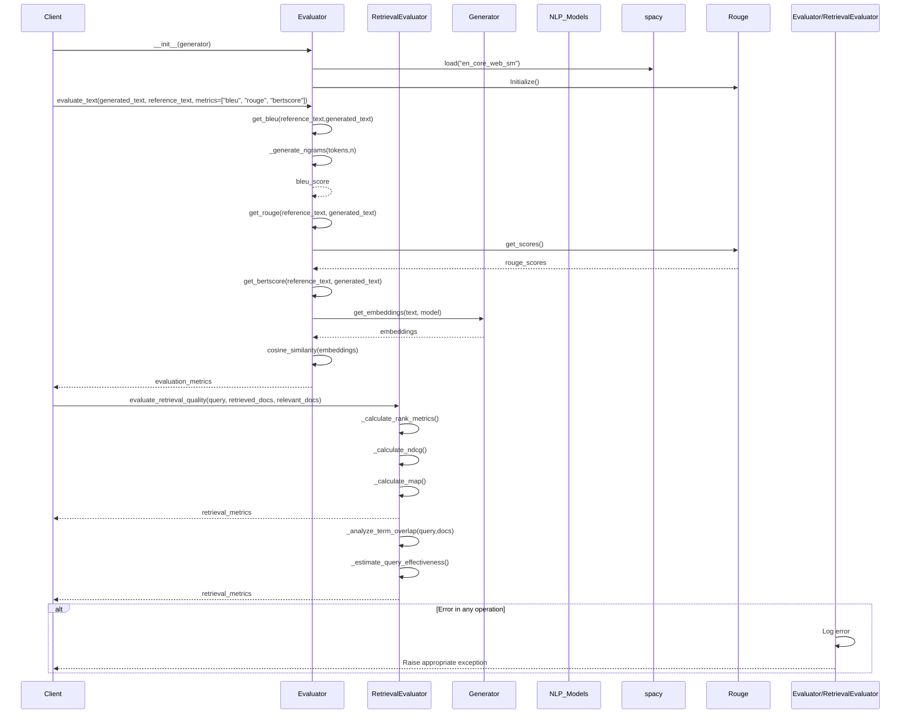

This document breaks down the sequence of interactions in the `evaluator.py` module.

## Key Components and Interactions

1. **Evaluator**: Main class for text quality evaluation
   - Implements BLEU, ROUGE, and BERTScore calculations
   - Handles text tokenization and preprocessing
   - Manages model initialization and text processing

2. **RetrievalEvaluator**: Specialized evaluator for retrieval systems
   - Implements ranking metrics (NDCG, MAP)
   - Analyzes term overlap and query effectiveness
   - Evaluates retrieval performance

3. **Generator**: Provides text embeddings for semantic evaluation
   - Used by Evaluator for BERTScore calculations
   - Handles model inference for embeddings

## Main Workflows

### Text Quality Evaluation
1. Tokenizes input texts
2. Calculates BLEU scores for n-gram precision
3. Computes ROUGE scores for recall-oriented metrics
4. Generates BERT embeddings for semantic similarity
5. Returns comprehensive metrics dictionary

### Retrieval System Evaluation
1. Processes query and document sets
2. Calculates precision, recall, and F1 scores
3. Computes ranking metrics (NDCG, MAP)
4. Analyzes term overlap between queries and documents
5. Estimates query effectiveness

## Error Handling
- Validates input formats and parameters
- Handles model loading errors gracefully
- Provides detailed error messages
- Implements fallback mechanisms for missing metrics
