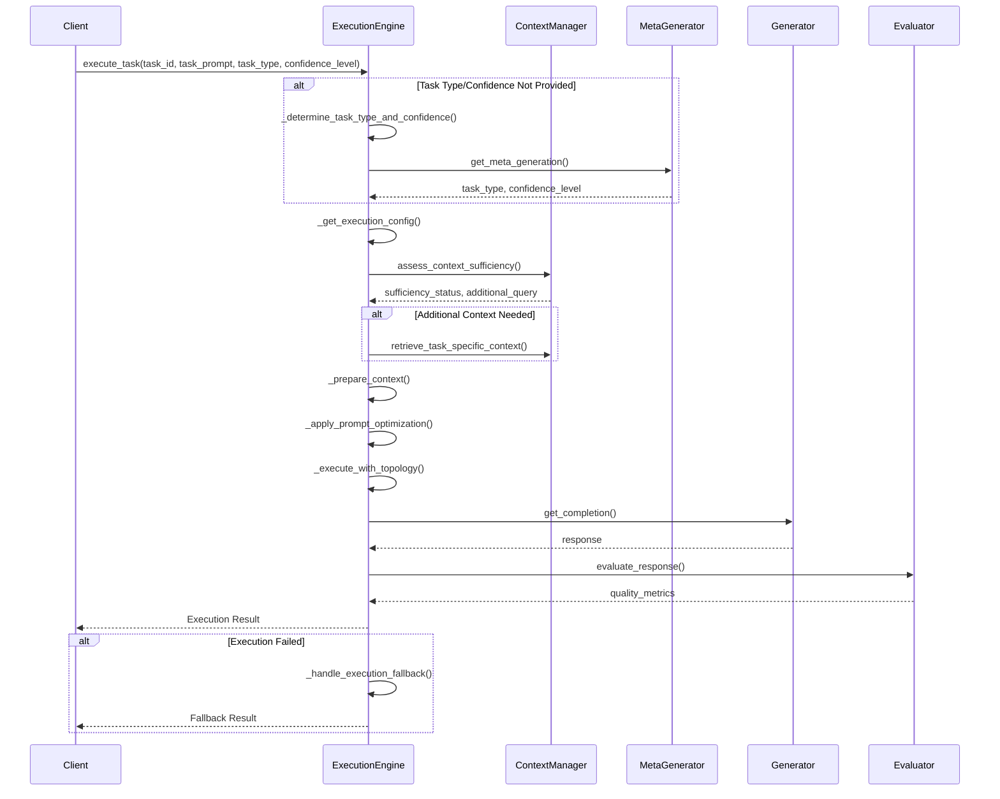

This document breaks down the sequence of interactions in the `executor.py` module.

```mermaid
sequenceDiagram
    participant Client
    participant ExecutionEngine
    participant ContextManager
    participant MetaGenerator
    participant Generator
    participant Evaluator
    
    Client->>ExecutionEngine: execute_task(task_id, task_prompt, task_type, confidence_level)
    
    alt Task Type/Confidence Not Provided
        ExecutionEngine->>ExecutionEngine: _determine_task_type_and_confidence()
        ExecutionEngine->>MetaGenerator: get_meta_generation()
        MetaGenerator-->>ExecutionEngine: task_type, confidence_level
    end
    
    ExecutionEngine->>ExecutionEngine: _get_execution_config()
    ExecutionEngine->>ContextManager: assess_context_sufficiency()
    ContextManager-->>ExecutionEngine: sufficiency_status, additional_query
    
    alt Additional Context Needed
        ExecutionEngine->>ContextManager: retrieve_task_specific_context()
    end
    
    ExecutionEngine->>ExecutionEngine: _prepare_context()
    ExecutionEngine->>ExecutionEngine: _apply_prompt_optimization()
    ExecutionEngine->>ExecutionEngine: _execute_with_topology()
    
    ExecutionEngine->>Generator: get_completion()
    Generator-->>ExecutionEngine: response
    
    ExecutionEngine->>Evaluator: evaluate_response()
    Evaluator-->>ExecutionEngine: quality_metrics
    
    ExecutionEngine-->>Client: Execution Result
    
    alt Execution Failed
        ExecutionEngine->>ExecutionEngine: _handle_execution_fallback()
        ExecutionEngine-->>Client: Fallback Result
    end
```