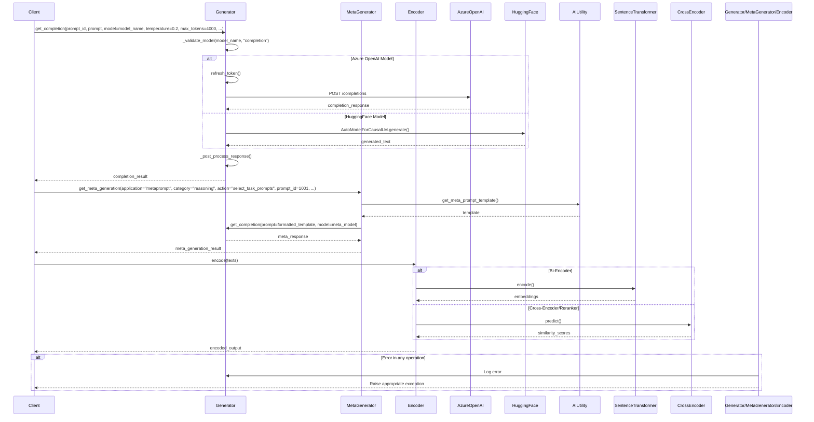

This document breaks down the sequence of interactions in the `generator.py` module.

## Key Components and Interactions

1. **Generator**: Main class for text generation
   - Handles model selection and validation
   - Manages API calls to different providers
   - Implements retry logic and error handling

2. **MetaGenerator**: Specialized generator for meta-prompting
   - Retrieves and formats meta-prompt templates
   - Handles structured responses using JSON schemas
   - Integrates with the base Generator for completions

3. **Encoder**: Handles text encoding and similarity
   - Supports bi-encoders for dense embeddings
   - Implements cross-encoders for document ranking
   - Manages model loading and inference

## Main Workflows

### Text Generation
1. Validates model and parameters
2. Routes to appropriate provider (Azure OpenAI or HuggingFace)
3. Processes and returns the generated text

### Meta-Prompting
1. Retrieves and formats meta-prompt template
2. Fills in template placeholders
3. Generates structured response
4. Validates and parses the output

### Text Encoding
1. Loads appropriate encoder model
2. Processes input text
3. Returns embeddings or similarity scores

## Error Handling
- Validates model names and parameters
- Implements retry logic for API calls
- Provides detailed error logging
- Falls back to alternative models when possible
