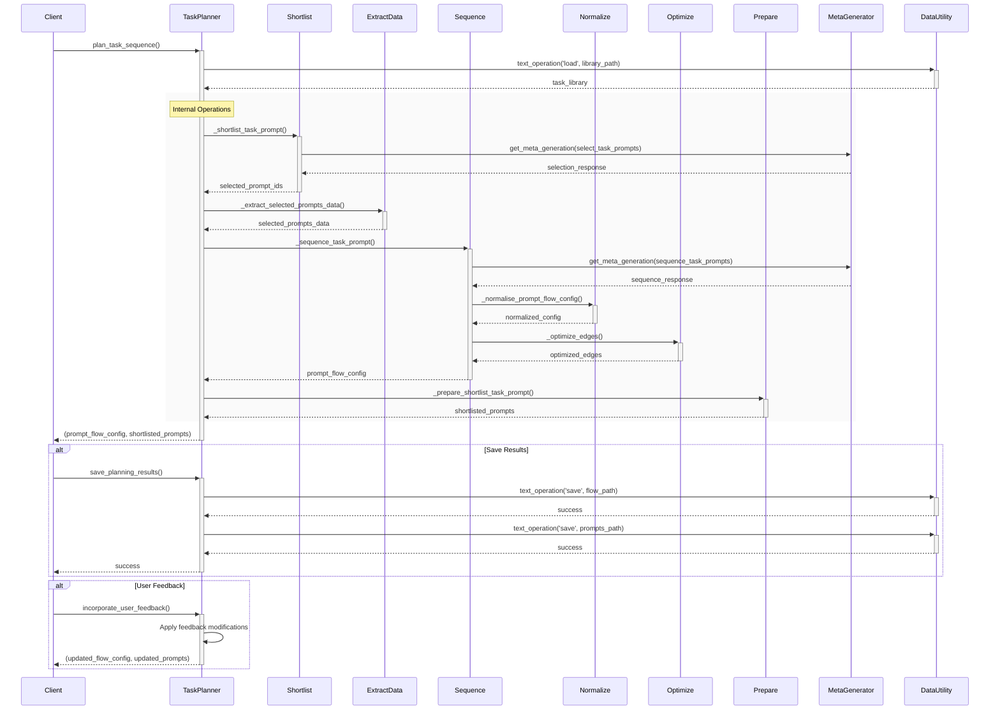

This document breaks down the sequence of interactions in the `planner.py` module, focusing on both external interactions and internal function calls within the TaskPlanner class.

## Key Components and Interactions

1. **TaskPlanner**: Main class that orchestrates the planning process
   - `_shortlist_task_prompt()`: Selects relevant prompts based on the goal
   - `_sequence_task_prompt()`: Sequences the selected prompts into an execution flow
   - `_normalise_prompt_flow_config()`: Validates and normalizes the flow configuration
   - `_prepare_shortlist_task_prompt()`: Prepares the final list of shortlisted prompts
   - `_extract_selected_prompts_data()`: Extracts full details of selected prompts
   - `_optimize_edges()`: Optimizes the flow graph for better parallelization
   - `_infer_task_type()`: Determines the type of task for a given prompt
   - `_select_best_selection_candidate()`: Chooses the best prompt selection from candidates
   - `_select_best_sequencing_candidate()`: Chooses the best sequence from candidates
   - `_generate_prompt_flow_config()`: Creates the prompt flow configuration
   - `_create_shortlisted_prompts()`: Creates the shortlisted prompts dictionary
   - `_calculate_complexity_score()`: Computes a complexity score for goals
   - `_basic_complexity_analysis()`: Provides fallback complexity analysis

2. **MetaGenerator**: Handles reasoning-based prompt selection and sequencing
3. **DataUtility**: Manages file I/O operations for loading/saving configurations
4. **AIUtility & Evaluator**: Support components for AI-related operations and evaluation

## Main Workflow

1. **Initialization**: The TaskPlanner is initialized with configuration and required utilities
2. **Prompt Shortlisting**: 
   - Loads task prompt library
   - Uses reasoning model to select relevant prompts based on the goal
3. **Prompt Sequencing**:
   - Sequences the shortlisted prompts into an optimal execution flow
   - Normalizes and optimizes the flow configuration
4. **Result Handling**:
   - Prepares the final shortlisted prompts dictionary
   - Optionally saves results to files
   - Handles user feedback for refinement

## Error Handling
- Falls back to basic selection/sequencing if reasoning model fails
- Includes validation steps to ensure configuration integrity
- Handles missing or invalid prompt IDs gracefully
- Provides fallback mechanisms for complexity analysis and task type inference
