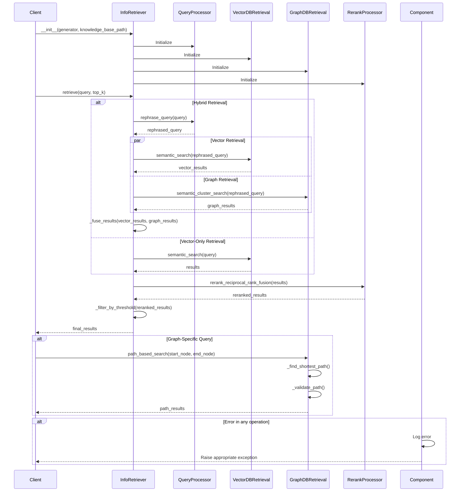

This document breaks down the sequence of interactions in the `retriever.py` module.

## Key Components and Interactions

1. **QueryProcessor**: Handles query transformation and optimization
   - Rephrases queries for better retrieval
   - Decomposes complex queries into sub-queries
   - Generates hypothetical documents (HyDE)

2. **VectorDBRetrieval**: Manages vector-based similarity search
   - Performs semantic search using embeddings
   - Handles dense vector retrieval
   - Manages vector index and queries

3. **GraphDBRetrieval**: Handles graph-based retrieval
   - Performs semantic cluster search
   - Manages path-based and connectivity queries
   - Handles hypergraph and multilayer graph operations

4. **RerankProcessor**: Improves result ordering
   - Applies reciprocal rank fusion
   - Uses cross-encoder models for relevance scoring
   - Combines multiple ranking signals

5. **InfoRetriever**: Main orchestrator
   - Coordinates retrieval strategies
   - Manages hybrid retrieval workflows
   - Handles result fusion and filtering

## Main Workflows

### Hybrid Retrieval
1. Query preprocessing and optimization
2. Parallel vector and graph retrieval
3. Result fusion and reranking
4. Threshold-based filtering

### Graph-Specific Queries
1. Path finding between nodes
2. Community detection
3. Temporal analysis
4. Cross-layer search

### Advanced Features
1. Query decomposition for complex questions
2. Hypothetical document generation (HyDE)
3. Multi-hop reasoning paths
4. Semantic clustering of results

## Error Handling
- Validates input queries and parameters
- Handles missing or corrupted indices
- Provides fallback mechanisms for failed operations
- Logs detailed error information for debugging
