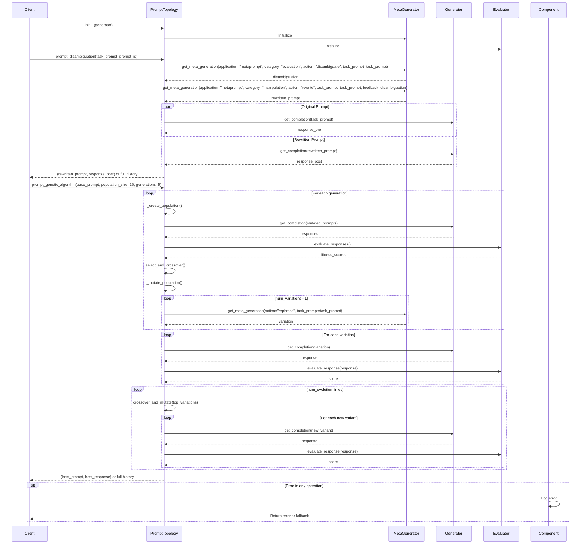

This document breaks down the sequence of interactions in the `topologist.py` module.

## Key Components and Interactions

1. **PromptTopology**: Main class implementing various prompt engineering strategies
   - Manages the execution flow of different topologies
   - Coordinates between generators, evaluators, and other components
   - Handles error cases and fallback mechanisms

2. **MetaGenerator**: Handles meta-level prompt operations
   - Generates variations of prompts
   - Performs disambiguation and rewriting
   - Manages prompt templates and patterns

3. **Generator**: Core text generation component
   - Executes prompts using various models
   - Handles model-specific parameters and configurations
   - Manages response generation and formatting

4. **Evaluator**: Assesses prompt and response quality
   - Provides feedback on response quality
   - Scores variations for genetic algorithm
   - Supports multiple evaluation metrics

## Main Workflows

### Prompt Disambiguation
1. Analyze input prompt for ambiguity
2. Generate disambiguation suggestions
3. Rewrite prompt based on analysis
4. Execute both original and rewritten prompts
5. Return improved results

### Genetic Algorithm
1. Generate initial population of prompt variations
2. Evaluate each variation's performance
3. Select top performers for reproduction
4. Apply crossover and mutation
5. Repeat for specified number of generations
6. Return best performing prompt

### Regenerative Majority Synthesis (from Memory)
1. Generate multiple initial responses
2. Truncate and regenerate responses
3. Apply majority vote or synthesis
4. Use parameters: num_initial_responses, num_regen_responses, cut_off_fraction, synthesis_method

## Error Handling
- Validates input prompts and parameters
- Handles API failures and timeouts
- Provides fallback mechanisms for failed generations
- Logs detailed error information for debugging
