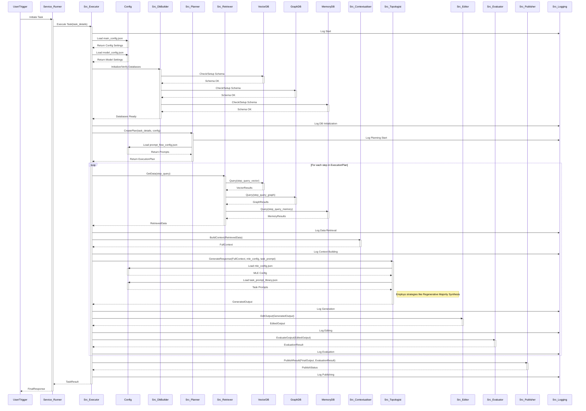

```mermaid
sequenceDiagram
    participant User/Trigger
    participant Runner as Service_Runner
    participant Executor as Src_Executor
    participant Config
    participant DbBuilder as Src_DbBuilder
    participant Planner as Src_Planner
    participant Retriever as Src_Retriever
    participant VectorDB
    participant GraphDB
    participant MemoryDB
    participant Contextualiser as Src_Contextualiser
    participant Topologist as Src_Topologist
    participant Editor as Src_Editor
    participant Evaluator as Src_Evaluator
    participant Publisher as Src_Publisher
    participant Logger as Src_Logging

    User/Trigger->>Runner: Initiate Task
    activate Runner
    Runner->>Executor: Execute Task(task_details)
    activate Executor
    Executor->>Logger: Log Start
    Executor->>Config: Load main_config.json
    activate Config
    Config-->>Executor: Return Config Settings
    deactivate Config
    Executor->>Config: Load model_config.json
    activate Config
    Config-->>Executor: Return Model Settings
    deactivate Config

    Executor->>DbBuilder: Initialize/Verify Databases
    activate DbBuilder
    DbBuilder->>VectorDB: Check/Setup Schema
    activate VectorDB
    VectorDB-->>DbBuilder: Schema OK
    deactivate VectorDB
    DbBuilder->>GraphDB: Check/Setup Schema
    activate GraphDB
    GraphDB-->>DbBuilder: Schema OK
    deactivate GraphDB
    DbBuilder->>MemoryDB: Check/Setup Schema
    activate MemoryDB
    MemoryDB-->>DbBuilder: Schema OK
    deactivate MemoryDB
    DbBuilder-->>Executor: Databases Ready
    deactivate DbBuilder
    Executor->>Logger: Log DB Initialization

    Executor->>Planner: CreatePlan(task_details, config)
    activate Planner
    Planner->>Logger: Log Planning Start
    Planner->>Config: Load prompt_flow_config.json
    activate Config
    Config-->>Planner: Return Prompts
    deactivate Config
    Planner-->>Executor: Return ExecutionPlan
    deactivate Planner

    loop For each step in ExecutionPlan
        Executor->>Retriever: GetData(step_query)
        activate Retriever
        Retriever->>VectorDB: Query(step_query_vector)
        activate VectorDB
        VectorDB-->>Retriever: VectorResults
        deactivate VectorDB
        Retriever->>GraphDB: Query(step_query_graph)
        activate GraphDB
        GraphDB-->>Retriever: GraphResults
        deactivate GraphDB
        Retriever->>MemoryDB: Query(step_query_memory)
        activate MemoryDB
        MemoryDB-->>Retriever: MemoryResults
        deactivate MemoryDB
        Retriever-->>Executor: RetrievedData
        deactivate Retriever
        Executor->>Logger: Log Data Retrieval

        Executor->>Contextualiser: BuildContext(RetrievedData)
        activate Contextualiser
        Contextualiser-->>Executor: FullContext
        deactivate Contextualiser
        Executor->>Logger: Log Context Building

        Executor->>Topologist: GenerateResponse(FullContext, mle_config, task_prompt)
        activate Topologist
        Topologist->>Config: Load mle_config.json
        activate Config
        Config-->>Topologist: MLE Config
        deactivate Config
        Topologist->>Config: Load task_prompt_library.json
        activate Config
        Config-->>Topologist: Task Prompts
        deactivate Config
        note right of Topologist: Employs strategies like Regenerative Majority Synthesis
        Topologist-->>Executor: GeneratedOutput
        deactivate Topologist
        Executor->>Logger: Log Generation

        Executor->>Editor: EditOutput(GeneratedOutput)
        activate Editor
        Editor-->>Executor: EditedOutput
        deactivate Editor
        Executor->>Logger: Log Editing

        Executor->>Evaluator: EvaluateOutput(EditedOutput)
        activate Evaluator
        Evaluator-->>Executor: EvaluationResult
        deactivate Evaluator
        Executor->>Logger: Log Evaluation
    end

    Executor->>Publisher: PublishResult(FinalOutput, EvaluationResult)
    activate Publisher
    Publisher-->>Executor: PublishStatus
    deactivate Publisher
    Executor->>Logger: Log Publishing

    Executor-->>Runner: TaskResult
    deactivate Executor
    Runner-->>User/Trigger: FinalResponse
    deactivate Runner
```
